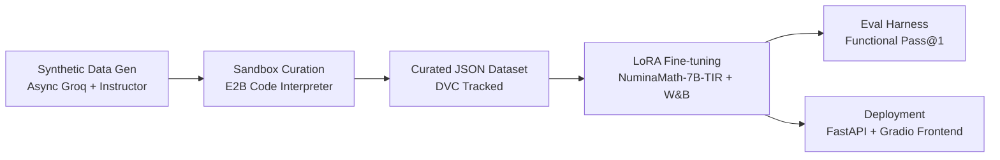

# Math2Code (LaTeX → Executable Python Code)

> Fine-tuning a math LLM to **translate LaTeX mathematical expressions into runnable, numerically-correct Python (SymPy) code**. A complete production pipeline: synthetic data generation → E2B safe sandbox curation → LoRA fine-tuning → functional-correctness evaluation harness → FastAPI + Gradio deployment.

[](https://www.python.org)
[](https://pytorch.org)
[](https://opensource.org/licenses/MIT)
[](https://github.com/your-username/math2code/actions/workflows/ci.yml)

---

## What this project does

Given a LaTeX expression such as:

```latex
\frac{x^{2} + 3y^{2}}{2x + 5y}
```

The model generates an executable Python function that evaluates it symbolically/numerically with SymPy:

```python
import sympy as sp

def algebraic_function(x, y):
    x, y = sp.symbols('x y')
    expression = (x**2 + 3*y**2) / (2*x + 5*y)
    return expression.subs({x: x, y: y})
```

This turns "math on paper" into code an AI agent or program can actually run, verify, and compose — useful for automated math tutoring, symbolic-computation agents, and verifiable tool-use.

---

## Architecture & Pipeline



## Repository Structure

```text
Math2Code/
├── configs/
│   └── train.yaml            # Hydra configuration for fine-tuning
├── data/
│   └── final/                # DVC tracked curated datasets
├── notebooks/                # Original capstone prototyping notebooks
├── src/
│   ├── data/
│   │   ├── generate.py       # Pydantic structured data generation
│   │   └── curate.py         # E2B safe sandbox execution curation
│   ├── model/
│   │   └── train.py          # PEFT/LoRA SFTTrainer script with W&B
│   ├── evaluation/
│   │   └── eval.py           # E2B-powered Pass@1 evaluation harness
│   └── serve/
│       ├── api.py            # FastAPI inference server
│       └── app.py            # Gradio interactive frontend
├── tests/                    # Pytest suite
├── .github/workflows/ci.yml  # GitHub Actions CI
├── docker-compose.yml        # Dockerized deployment
├── Dockerfile                # API & App Container
└── pyproject.toml            # uv dependencies & project config
```

---

## Quick Start (Docker)

To run the interactive Gradio demo and FastAPI backend locally:

```bash
# 1. Provide your E2B API Key in the environment
export E2B_API_KEY="e2b_..."

# 2. Spin up the stack
docker compose up --build
```

- **Frontend (Gradio):** http://localhost:8501
- **Backend (FastAPI):** http://localhost:8000/docs

---

## ML Engineering & MLOps Features

- **Safe Sandbox Execution:** Uses [E2B Code Interpreter](https://e2b.dev/) to securely execute LLM-generated code during dataset curation and evaluation, preventing malicious code execution.
- **Structured Generation:** Uses `instructor` and `pydantic` to enforce perfect JSON outputs from the LLM generator.
- **Experiment Tracking:** Uses **Weights & Biases** to log LoRA fine-tuning hyperparameters, loss curves, and hardware metrics.
- **Configuration Management:** Uses **Hydra** for scalable, YAML-based training configuration.
- **Data Versioning:** Datasets are tracked via **DVC**.
- **Containerized Inference:** Deployed using a modern **FastAPI** backend connected to a **Gradio** UI.

---

## Benchmarks & Evaluation

Accuracy is measured by **functional correctness (Pass@1)**, not string matching. The model's output is extracted and safely executed in the E2B Code Interpreter against test inputs to ensure the symbolic math matches the ground truth.

| Model | Functional Correctness (Pass@1) |
|-------|---------------------------------|
| GPT-4o-mini (Zero-Shot) | *Pending* |
| Claude 3.5 Sonnet (Zero-Shot) | *Pending* |
| DeepSeek-Math-7B-Base | *Pending* |
| **Math2Code Fine-Tuned (NuminaMath-7B)** | **XX.X%** |

*(Update table with final results after running `src/evaluation/eval.py`)*
